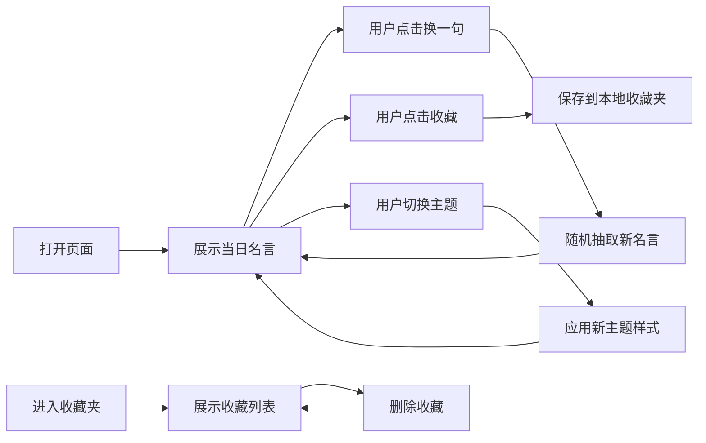

# 每日名言卡片 - 产品需求文档

## 1. 产品概述

每日名言卡片是一款优雅的网页应用，每天为用户呈现一句富有哲理的名言。用户可以随机切换名言、收藏喜欢的句子，并在多种精美的卡片主题之间切换，享受每日的精神滋养。

- 核心目标：每日一句有分量的话，给用户带来启发和力量
- 目标用户：喜欢阅读、追求内心成长的人群
- 产品价值：用极简优雅的设计，让名言阅读成为每日仪式

## 2. 核心功能

### 2.1 用户角色

| 角色 | 注册方式 | 核心权限 |
|------|----------|----------|
| 普通用户 | 无需注册 | 浏览名言、切换主题、收藏管理 |

### 2.2 功能模块

1. **主页**：名言卡片展示、日期显示、随机切换、收藏按钮、主题切换
2. **收藏夹**：收藏列表展示、取消收藏、卡片预览

### 2.3 页面详情

| 页面名称 | 模块名称 | 功能描述 |
|----------|----------|----------|
| 主页 | 名言卡片 | 展示当日日期和名言，支持多种主题样式 |
| 主页 | 操作区 | 随机换一句、收藏/取消收藏、切换主题入口 |
| 收藏夹页 | 收藏列表 | 网格展示所有收藏的名言卡片 |
| 收藏夹页 | 管理功能 | 点击可删除单条收藏 |

## 3. 核心流程

## 4. 用户界面设计

### 4.1 设计风格

- **整体风格**：素雅文艺、精致考究、有仪式感
- **主色调**：淡米色背景、深墨色文字
- **卡片样式**：柔和阴影、圆角适中、质感细腻
- **字体**：优雅的衬线体配合简洁的无衬线体
- **动效**：微妙的过渡动画、淡入淡出效果

### 4.2 卡片主题

| 主题名称 | 风格描述 | 配色方案 |
|----------|----------|----------|
| 简洁素雅 | 极简现代、干净利落 | 米白背景 + 深灰文字 |
| 复古羊皮纸 | 怀旧温暖、书卷气息 | 泛黄纸色 + 棕褐文字 |
| 水墨东方 | 水墨意境、东方韵味 | 宣纸白底 + 墨黑文字 |

### 4.3 页面设计概览

| 页面名称 | 模块名称 | UI 元素 |
|----------|----------|---------|
| 主页 | 名言卡片 | 居中卡片、日期标题、名言正文、作者署名 |
| 主页 | 底部操作栏 | 换一句按钮、收藏按钮、主题切换按钮、收藏夹入口 |
| 收藏夹页 | 顶部导航 | 返回按钮、页面标题 |
| 收藏夹页 | 卡片网格 | 响应式网格布局、悬浮删除按钮 |

### 4.4 响应式设计

- 桌面端：卡片居中展示，最大宽度限制
- 平板端：卡片宽度自适应
- 移动端：全屏卡片，操作按钮底部固定
- 触摸优化：按钮尺寸适合手指点击

