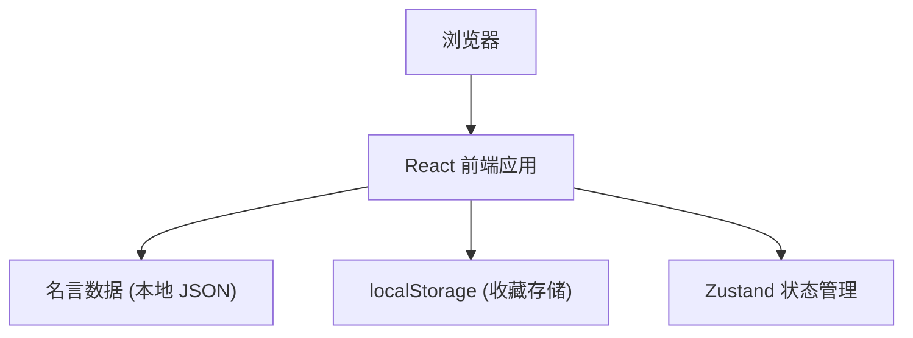

# 每日名言卡片 - 技术架构文档

## 1. 架构设计



## 2. 技术选型

- **前端框架**：React 18 + TypeScript
- **构建工具**：Vite 5
- **样式方案**：Tailwind CSS 3
- **状态管理**：Zustand
- **路由方案**：React Router DOM
- **图标库**：Lucide React
- **数据存储**：localStorage（收藏数据）

## 3. 目录结构

```
src/
├── components/          # 可复用组件
│   ├── QuoteCard.tsx   # 名言卡片组件
│   ├── ThemeSelector.tsx # 主题选择器
│   └── Header.tsx      # 页头导航
├── pages/               # 页面组件
│   ├── Home.tsx        # 主页
│   └── Favorites.tsx   # 收藏夹页
├── data/                # 数据
│   └── quotes.ts       # 名言库数据
├── store/               # 状态管理
│   └── useQuoteStore.ts # 名言和收藏状态
├── hooks/               # 自定义 hooks
│   └── useTheme.ts     # 主题切换 hook
├── types/               # 类型定义
│   └── index.ts
├── utils/               # 工具函数
│   └── date.ts         # 日期格式化
├── App.tsx
├── main.tsx
└── index.css
```

## 4. 数据模型

### 4.1 名言数据结构

```typescript
interface Quote {
  id: string;
  text: string;
  author: string;
  category?: string;
}
```

### 4.2 主题配置

```typescript
interface Theme {
  id: string;
  name: string;
  cardBg: string;
  cardText: string;
  cardAccent: string;
  pageBg: string;
  borderStyle: string;
}
```

## 5. 状态管理

使用 Zustand 管理全局状态：

- `currentQuote`: 当前展示的名言
- `favorites`: 收藏列表
- `currentTheme`: 当前主题
- `setCurrentQuote`: 设置当前名言
- `toggleFavorite`: 切换收藏状态
- `setTheme`: 切换主题

## 6. 核心功能实现

### 6.1 每日名言
- 首次访问根据日期哈希确定当日名言
- 点击"换一句"随机抽取新名言

### 6.2 收藏功能
- 收藏数据存储在 localStorage
- 支持添加和删除收藏
- 收藏夹页面展示所有收藏

### 6.3 主题切换
- 提供 3 种预设主题
- 主题状态持久化到 localStorage
- 通过 CSS 变量动态切换样式

